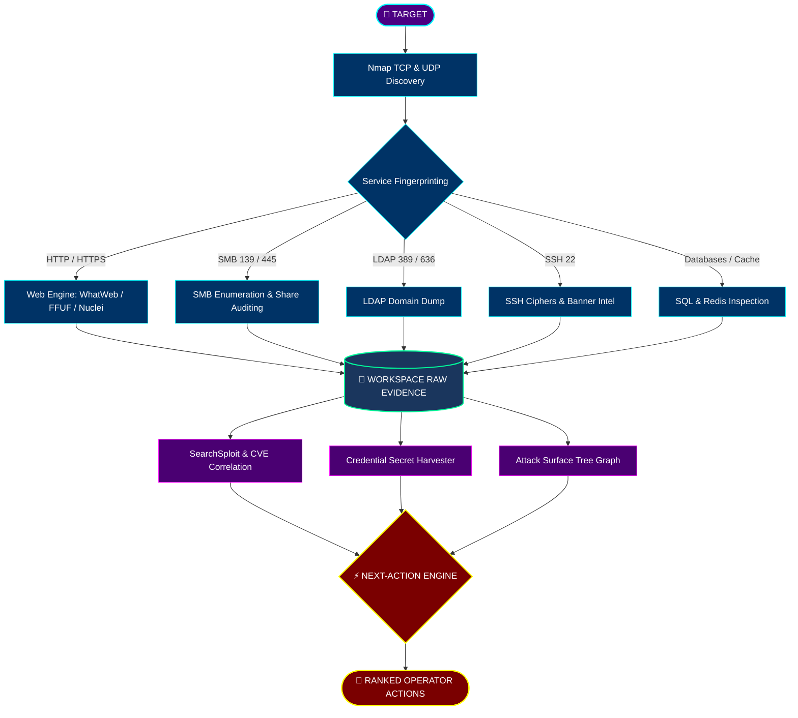

<div align="center">

# ⚡ H O R C R U X ⚡

### *The fragments reveal the whole.*

[](https://git.io/typing-svg)

<p align="center">
  
  
  
  
  
</p>

```text
            ██╗  ██╗ ██████╗ ██████╗  ██████╗██████╗ ██╗   ██╗██╗  ██╗
            ██║  ██║██╔═══██╗██╔══██╗██╔════╝██╔══██╗╚██╗ ██╔╝╚██╗██╔╝
            ███████║██║   ██║██████╔╝██║     ██████╔╝ ╚████╔╝  ╚███╔╝ 
            ██╔══██║██║   ██║██╔══██╗██║     ██╔══██╗  ╚██╔╝   ██╔██╗ 
            ██║  ██║╚██████╔╝██║  ██║╚██████╗██║  ██║   ██║   ██╔╝ ██╗
            ╚═╝  ╚═╝ ╚═════╝ ╚═╝  ╚═╝ ╚═════╝╚═╝  ╚═╝   ╚═╝   ╚═╝  ╚═╝
```

**An intelligent, operator-centric offensive-security orchestration platform.**  
*Transforming the fragmented first stages of security assessments into an evidence-driven, structured workflow.*

[Features](#-key-features) • [Quick Start](#-quick-start) • [Architecture](#-architecture--pipeline) • [Terminal UI](#-terminal-ui--animations) • [Artifacts Gallery](#-horcrux-artifacts-gallery) • [Doctor](#-doctor--prerequisites)

</div>

---

> [!NOTE]
> **HORCRUX** does not replace the security tools you trust. It **orchestrates** them. It executes network reconnaissance, service fingerprinting, content discovery, and vulnerability intelligence, recording every byte of raw evidence while presenting a prioritized **Next Best Action** roadmap.

---

## ✦ Orchestration Pipeline



---

## ⚡ Key Features

* **Real Tool Orchestration**: Transparently delegates work to native Kali/Linux binaries—`nmap`, `ffuf`, `gobuster`, `whatweb`, `nuclei`, `smbclient`, `searchsploit`, and more.
* **Persistent Workspaces**: Every assessment gets an isolated workspace tracking structured state (`state.json`), raw command logs, headers, and HTTP responses.
* **Attack Surface Tree Graph**: Interactive Rich visual hierarchy linking targets, open ports, fingerprinted services, vulnerabilities, and leaked credentials.
* **Prioritized Next Actions**: Algorithmic ranking engine calculating the highest ROI next step based on evidence confidence and attack prerequisites.
* **Exploit Intelligence**: Correlates software versions with SearchSploit and CVE databases while strictly maintaining operator control over execution.
* **Horcrux Artifact Gallery**: Built-in showcase of thematic ASCII relics representing the 7 Horcruxes and Deathly Hallows.
* **Luminous Terminal Aesthetics**: Dynamic color waves, TrueColor gradients, animated sparkle trails, and runic progress spinners.

---

## 🚀 Quick Start

### 1. Installation

#### Linux / Kali Linux
```bash
git clone https://github.com/aadithya-vimal/horcrux.git
cd horcrux
chmod +x install.sh
./install.sh
```

#### Windows (PowerShell)
```powershell
git clone https://github.com/aadithya-vimal/horcrux.git
cd horcrux
Set-ExecutionPolicy -Scope Process -ExecutionPolicy Bypass
.\install.ps1
```

#### Manual Python Setup
```bash
python3 -m venv .venv
source .venv/bin/activate  # On Windows: .venv\Scripts\Activate.ps1
pip install -r requirements.txt
pip install -e .
```

---

### 2. Basic Usage

```bash
# Launch interactive operator console
horcrux

# One-shot reconnaissance against a target
horcrux 10.10.10.10

# Deep port scanning and aggressive enumeration
horcrux 10.10.10.10 --deep

# Check installed security tools and SecLists wordlists
horcrux doctor

# View the Horcrux ASCII art relics gallery
horcrux gallery
```

---

## 🖥 Terminal UI & Animations

HORCRUX delivers a terminal experience with animated feedback, shimmering headers, and visual data structures.

### Animated Color Banners & Spinners

```text
  ✦ ᚛ ᚠ ⟦  ▰▰▰▱▱▱▱▱▱▱  ⟧ Mapping TCP/UDP surface... ✦
  ✔ Mapping TCP/UDP surface
  ✦ ᚛ ᚢ ⟦  ▰▰▰▰▰▱▱▱▱▱  ⟧ Fingerprinting HTTP :80... ✦
  ✔ Fingerprinting HTTP :80
  ✦ ᚛ ᚦ ⟦  ▰▰▰▰▰▰▰▱▱▱  ⟧ Correlating SearchSploit intelligence... ✦
  ✔ Correlating SearchSploit intelligence
```

### Live Status Dashboard (`status`)

```text
╭─────────────────────────────────────────────────────────────────────────────╮
│ ❖ TARGET WORKSPACE: 10.10.10.10  |  STORAGE: workspaces/10.10.10.10         │
╰─────────────────────────────────────────────────────────────────────────────╯
╭ 🌐 SERVICES ╮  ╭ 📦 SOFTWARE ╮  ╭ ⚡ FINDINGS ╮  ╭ 🔑 CREDS ╮  ╭ 🎯 EXPLOITS ╮
│      3      │  │      2      │  │      3      │  │    2     │  │      1      │
│    Open     │  │ Identified  │  │   Recorded  │  │ Captured │  │ Correlated  │
╰─────────────╯  ╰─────────────╯  ╰─────────────╯  ╰──────────╯  ╰─────────────╯

╭──────────────────────── ⬡ DETECTED WEB TECHNOLOGIES ────────────────────────╮
│  nginx  •  PHP 8.1  •  WordPress 6.2                                        │
╰─────────────────────────────────────────────────────────────────────────────╯

╔═══════════════════════════ ★ NEXT BEST ACTION ★ ════════════════════════════╗
║  ⚡ Enumerate readable SMB shares                                           ║
║  Reason: Anonymous SMB connection verified  • Score: 96                     ║
╚═════════════════════════════════════════════════════════════════════════════╝
```

---

### Interactive Attack Surface Graph (`graph`)

```text
╭────────────────── ✦ ATTACK SURFACE GRAPH — 10.10.10.10 ✦ ───────────────────╮
│                                                                             │
│  ❖ TARGET 10.10.10.10                                                       │
│  ├── 🌐 OPEN SERVICES (3)                                                   │
│  │   ├── ● 22/TCP ssh (OpenSSH 8.9p1)                                       │
│  │   │   └──  ● LOW  SSH Server Supports Weak Ciphers                       │
│  │   ├── ● 80/TCP http (nginx 1.18.0)                                       │
│  │   │   └──  ◈ MEDIUM  WordPress xmlrpc.php Exposed                        │
│  │   └── ● 445/TCP microsoft-ds (Samba 4.15.5)                              │
│  │       └──  ▲ HIGH  Anonymous SMB Share Access                            │
│  ├── ⚡ DETECTED FINDINGS (3)                                               │
│  │   ├──  ▲ HIGH  Anonymous SMB Share Access (verified)                     │
│  │   ├──  ◈ MEDIUM  WordPress xmlrpc.php Exposed (suspected)                │
│  │   └──  ● LOW  SSH Server Supports Weak Ciphers (suspected)               │
│  ├── 🔑 CREDENTIALS (2)                                                     │
│  │   ├── anonymous (smb) from smbclient                                     │
│  │   └── admin (web) from wp-config.php.bak                                 │
│  └── ⬡ WEB TECHNOLOGIES (3)                                                 │
│      ├── nginx                                                              │
│      ├── PHP 8.1                                                            │
│      └── WordPress 6.2                                                      │
│                                                                             │
╰─────────────────────────────────────────────────────────────────────────────╯
```

---

### Findings with Confidence Meters (`findings`)

```text
                      ✦ SECURITY FINDINGS — 10.10.10.10 ✦                      
┌────────────┬──────────────┬──────────────────────────────────┬──────────────┐
│  Severity  │  Confidence  │ Title                            │    Status    │
├────────────┼──────────────┼──────────────────────────────────┼──────────────┤
│   ▲ HIGH   │ ████████ 95% │ Anonymous SMB Share Access       │  ✔ VERIFIED  │
│  ◈ MEDIUM  │ ███████░ 85% │ WordPress xmlrpc.php Exposed     │ ❓ SUSPECTED │
│    ● LOW   │ █████░░░ 60% │ SSH Server Supports Weak Ciphers │ ❓ SUSPECTED │
└────────────┴──────────────┴──────────────────────────────────┴──────────────┘
```

---

### Prioritized Next Actions (`next`)

```text
                  ✦ PRIORITIZED NEXT ACTIONS — 10.10.10.10 ✦                   
┌──────┬───────┬──────────────────────────────┬───────────────────────────────┐
│ Rank │ Score │ Action                       │ Reason / Prerequisite         │
├──────┼───────┼──────────────────────────────┼───────────────────────────────┤
│  ①   │  96   │ Enumerate readable SMB       │ Anonymous SMB connection      │
│      │       │ shares                       │ verified                      │
│  ②   │  92   │ Test WordPress admin         │ Recovered admin password from │
│      │       │ credentials                  │ backup                        │
└──────┴───────┴──────────────────────────────┴───────────────────────────────┘
```

---

## 🏛 Horcrux Artifacts Gallery

HORCRUX weaves the lore of ancient artifacts into its terminal identity. View the full gallery at any time with `horcrux gallery`.

<details>
<summary><b>View Artifacts (The 7 Horcruxes & Relics)</b></summary>

### 1. The Elder Wand · *Deathly Hallow*
```text
           · ✦ ·
             │
            ░█░
             │
           ▓███▓
          ░█████░
           ▓███▓
             │
            ╲█╱
           ░▓█▓░
             │
           ▓███▓
             ▾
```
> *The Deathstick. Wand of Destiny. Unyielding conduit of raw power.*

---

### 2. Tom Riddle's Diary · *Horcrux I*
```text
         ._____________________.
        /  _________________  /|
       /  /  T.M. RIDDLE   / / |
      /  /                / /  |
     /  /     ╭──────╮   / /   |
    |  |      │ ✦ ✦  │  | |    |
    |  |      │  ▼   │  | |    |
    |  |      ╰──────╯  | |   /
    |  |   ink bleeds   | |  /
    |  |________________|/  /
    |______________________/
```
> *Blank parchment drenched in memory and dark enchantments.*

---

### 3. Marvolo Gaunt's Ring · *Horcrux II*
```text
             .─────────.
           .'    ___    '.
          /    .'   '.    \
         |    /   ▲   \    |
         |   |  / ┃ \  |   |
         |    \ ━━┻━━ /    |
          \    '.___.'    /
           '.           .'
             '─────────'
              │ ✦ ✦ ✦ │
               \_____/
```
> *Ancient gold band holding the Resurrection Stone signet.*

---

### 4. Salazar Slytherin's Locket · *Horcrux III*
```text
              ╱╲_____╱╲
             │  \___/  │
              ╲   │   ╱
             .─┴──────┴─.
            /  ╭─────╮   \
           |   │  S  │    |
           |   │ ╭─╯ │    |
           |   │ ╰─╮ │    |
            \  ╰─────╯   /
             '.   ✦   .'
               '─────'
```
> *Heavy golden medallion emblazoned with the serpentine crest.*

---

### 5. Helga Hufflepuff's Cup · *Horcrux IV*
```text
           \╲  ✦ ✦ ✦  ╱/
            \╲_______╱/
             |       |
            (| ╭───╮ |)
             | │ ✦ │ |
             | ╰───╯ |
              \     /
               )   (
              /     \
             /_______\
```
> *Two-handled golden chalice engraved with the steadfast badger.*

---

### 6. Rowena Ravenclaw's Diadem · *Horcrux V*
```text
              .─.     .─.
             /   \ ✦ /   \
            /  /\ \ / /\  \
           /  /  \_V_/  \  \
          /  /           \  \
         (__(    ╭───╮    )__)
              \  │ ♦ │  /
               \ ╰───╯ /
                '─────'
```
> *Wit beyond measure is man's greatest treasure.*

---

### 7. Nagini the Serpent · *Horcrux VI*
```text
             .-==-._
            /  ✦ ✦  \
           |   (oo)  |
            \   ==  /
             '._  _.'
                ||
            _.-'  '-._
          .'  _...._  '.
         /  .'      '.  \
        |  /          \  |
         \ '.________.' /
          '._        _.'
             `''''''`
```
> *The great venomous serpent woven into Voldemort's soul.*

---

### 8. The Seventh Fragment · *The Scar*
```text
              \     /
               \   /
                \ /
                 V
                / \
               /   \
                 \
             .---.   .---.
            /     \ /     \
           |   O   X   O   |
            \     / \     /
             '---'   '---'
```
> *The curse that rebounded, leaving a lightning bolt etched in fate.*

---

### 9. The Deathly Hallows · *Master of Death*
```text
                 ▲
                /│\
               / │ \
              /  │  \
             /  ╭●╮  \
            /  │ │ │  \
           /   │ │ │   \
          /     ╰●╯     \
         /_______│_______\
```
> *The Wand, the Stone, and the Cloak. Together, conquerors of mortality.*

</details>

---

## 🩺 Doctor & Prerequisites

HORCRUX includes an automated environment auditor to check for external binaries and wordlists:

```bash
horcrux doctor
```

```text
                         ✦ HORCRUX TOOL ECOSYSTEM AUDIT ✦                         
┌────────────────────────┬────────────┬───────────────────────────────────────┐
│ Tool                   │   Status   │ Purpose                               │
├────────────────────────┼────────────┼───────────────────────────────────────┤
│ nmap                   │    ✔ OK    │ Network discovery                     │
│ rustscan               │ ✖ MISSING  │ Fast TCP discovery                    │
│ ffuf                   │    ✔ OK    │ Web fuzzing                           │
│ gobuster               │    ✔ OK    │ Web/content/DNS discovery             │
│ nuclei                 │    ✔ OK    │ Template-based vulnerability checks   │
│ whatweb                │    ✔ OK    │ Web fingerprinting                    │
│ smbclient              │    ✔ OK    │ SMB enumeration                       │
│ searchsploit           │    ✔ OK    │ Exploit/CVE lookup                    │
│ netexec                │ ✖ MISSING  │ SMB/LDAP/Kerberos/WinRM               │
└────────────────────────┴────────────┴───────────────────────────────────────┘

                         ✦ WORDLIST DISCOVERY AUDIT ✦                          
┌───────────────────────────────────────────────┬───────────┬─────────────────┐
│ Wordlist                                      │  Status   │ Location / Path │
├───────────────────────────────────────────────┼───────────┼─────────────────┤
│ rockyou.txt                                   │  ✔ FOUND  │ /usr/share/w... │
│ seclists/Discovery/Web-Content/common.txt     │  ✔ FOUND  │ /usr/share/s... │
│ seclists/Discovery/Web-Content/raft-medium... │  ✔ FOUND  │ /usr/share/s... │
└───────────────────────────────────────────────┴───────────┴─────────────────┘
```

> [!TIP]
> Missing tools do **not** break HORCRUX. The orchestrator automatically skips unavailable tools or falls back to alternate discovery mechanisms.

---

## 📂 Workspace Structure

Every assessment is cleanly quarantined under its target identifier:

```text
workspaces/
└── 10.10.10.10/
    ├── state.json           # Machine-readable attack state
    ├── commands.log         # Complete log of executed commands
    ├── raw/                 # Raw tool outputs (nmap.xml, stdout, stderr)
    │   ├── nmap-tcp.stdout
    │   ├── nmap.xml
    │   └── ffuf-80.stdout
    ├── responses/           # Full HTTP response bodies
    │   ├── root.body
    │   └── wp-login.body
    ├── headers/             # Raw HTTP response headers
    └── reports/             # Generated Markdown engagement reports
```

To retrieve raw artifacts directly from the terminal without polluting your console:
```bash
horcrux source raw/nmap.xml
horcrux source responses/root.body
```

---

## 🛡 Responsible Use

> [!CAUTION]
> **HORCRUX** is designed exclusively for authorized penetration testing, security assessments, CTFs, and educational training in controlled lab environments (Hack The Box, TryHackMe, Proving Grounds, home labs). Operators must obtain explicit authorization before testing any network or system.

---

## 📜 License

Distributed under the **MIT License**. See [LICENSE](LICENSE) for more information.

<div align="center">

**⚡ The fragments reveal the whole. ⚡**

</div>
